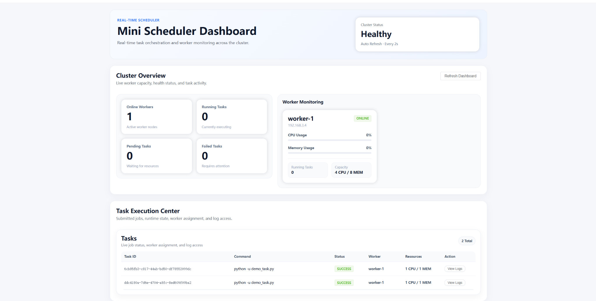
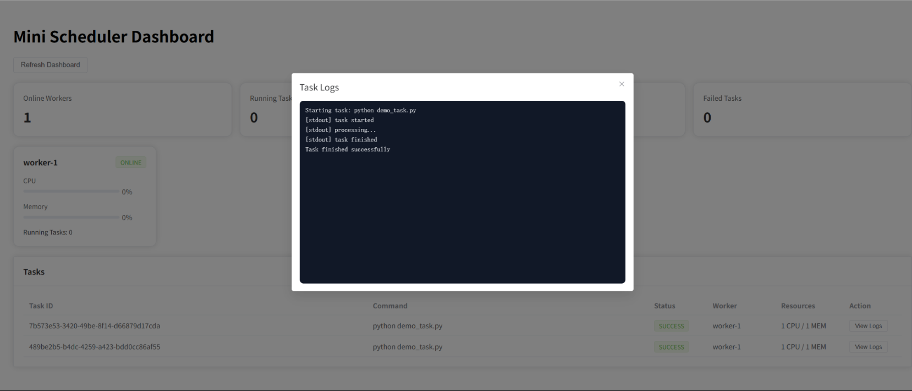

# Mini Scheduler – Distributed Task Scheduling System

A full-stack distributed task scheduling system that simulates cluster-level workload allocation, worker monitoring, and real-time task execution tracking.

## Demo

### Dashboard Overview
Real-time cluster monitoring with worker status, task distribution, and resource utilisation.



### Live Log Streaming
Interactive log viewer with smart auto-scroll behaviour that preserves user reading position.



## Key Highlights

- Designed and implemented a resource-aware scheduling algorithm inspired by **Bin Packing**
- Built **worker registration, heartbeat monitoring, and offline detection**
- Implemented full task lifecycle management: **PENDING → RUNNING → SUCCESS / FAILED**
- Developed a **real-time dashboard** for cluster monitoring using short polling
- Built **live log streaming** with UX-optimized auto-scroll behaviour
- Structured as a **full-stack system** using **FastAPI + Vue 3**

---

## Project Overview

Mini Scheduler is a lightweight distributed task scheduling system designed to simulate how a compute cluster manages workload allocation, worker health, and task execution visibility.

The system consists of:

- **Backend**: worker registration, task submission, resource-aware scheduling, task execution, state transitions, heartbeat tracking, offline detection, and log storage
- **Frontend**: dashboard visualisation for cluster overview, worker monitoring, task tracking, and live log viewing

This project was built as a technical assessment and focuses on system design, backend state management, and real-time frontend monitoring.

---

## Core Features

### Backend

- Worker auto-registration to the master node
- Periodic heartbeat reporting for CPU, memory, and running task status
- REST API for task submission with:
  - `command`
  - `cpu_required`
  - `mem_required`
- Resource-aware task allocation based on remaining worker capacity
- Automatic `PENDING` queue when no worker has enough available resources
- Periodic re-scheduling of pending tasks when resources become available
- Task lifecycle tracking:
  - `PENDING`
  - `RUNNING`
  - `SUCCESS`
  - `FAILED`
- Stdout log capture during task execution
- Log query API for live log viewing
- Automatic worker offline marking after heartbeat timeout

### Frontend

- Cluster overview dashboard
- Summary cards for:
  - Online Workers
  - Running Tasks
  - Pending Tasks
  - Failed Tasks
- Worker monitoring cards showing:
  - Worker ID
  - Host
  - CPU / Memory usage
  - Running tasks
  - Capacity
  - ONLINE / OFFLINE status
- Task table for task lifecycle tracking
- Live log modal for task stdout streaming
- Short polling for dashboard updates
- Visual offline state handling for unavailable workers
- UX-improved log auto-scroll that does not interrupt users reading historical logs

---

## System Architecture

### Backend Structure

- `main.py`
  - API routes
  - dashboard endpoints
  - worker registration / heartbeat
  - task creation / query / log APIs
  - background jobs for offline detection and pending task re-scheduling
- `scheduler.py`
  - worker selection logic
  - task allocation logic
- `schemas.py`
  - request body schemas
- `state.py`
  - in-memory state storage for workers, tasks, and task logs
- `worker.py`
  - simulated worker process with registration and heartbeat reporting

### Frontend Structure

- `Dashboard.vue`
  - page layout
- `SummaryCards.vue`
  - overview metrics
- `WorkerGrid.vue`
  - worker list section
- `WorkerCard.vue`
  - single worker monitoring card
- `TaskTable.vue`
  - task tracking table
- `LogModal.vue`
  - live log modal

---

## Scheduling Strategy

This project uses a simplified **resource-aware scheduling strategy** inspired by **Bin Packing**.

The core logic is:

1. Only consider workers marked as `ONLINE`
2. Check whether remaining CPU and memory satisfy task requirements
3. Select a suitable worker from the available candidates
4. If no worker can accept the task, mark it as `PENDING`
5. Periodically re-check pending tasks and dispatch them when capacity is restored

### Example

If Worker A has `4 CPU / 8 MEM`, and two tasks are submitted with `2 CPU / 4 MEM` each, both tasks can be scheduled onto Worker A successfully.

---

## Real-Time Interaction Design

### Dashboard Updates

The frontend uses **short polling** to request `/api/dashboard` every 2 seconds in order to update:

- cluster overview
- worker state
- task list

### Live Log Streaming

When a log modal is opened, the frontend polls `/api/tasks/{task_id}/logs` every 1 second to simulate live log streaming.

---

## Tech Stack

### Backend
- Python
- FastAPI
- Uvicorn
- Pydantic
- Asyncio
- Subprocess

### Frontend
- Vue 3
- Vite
- Element Plus
- Axios

---

## Local Setup

### Backend

From the `backend` directory:

```bash
python -m venv venv
```

Activate the virtual environment:

**Windows**
```bash
venv\Scripts\activate
```

**macOS / Linux**
```bash
source venv/bin/activate
```

Install dependencies:

```bash
pip install -r requirements.txt
```

Start the backend server:

```bash
uvicorn app.main:app --reload
```

API docs:  
`http://127.0.0.1:8000/docs`

### Frontend

From the `frontend` directory:

```bash
npm install
npm run dev
```

Dashboard:  
`http://localhost:5173/`

### Worker

From the `backend` directory:

```bash
python worker.py
```

The worker will automatically:

- register to the master
- start sending heartbeat updates

---

## Demo Scenarios

This project supports the following demonstrations:

- Worker starts and appears as `ONLINE`
- Task submission triggers `RUNNING`
- Completed task moves to `SUCCESS`
- Clicking `View Logs` opens live log streaming
- Stopping a worker marks it as `OFFLINE`
- When no worker is available, tasks enter `PENDING`
- Once capacity is restored, pending tasks are automatically re-scheduled

---

## Project Structure

```text
mini-scheduler/
├── backend/
│   ├── app/
│   │   ├── main.py
│   │   ├── scheduler.py
│   │   ├── schemas.py
│   │   └── state.py
│   ├── worker.py
│   ├── demo_task.py
│   └── requirements.txt
├── frontend/
│   ├── public/
│   │   ├── favicon.svg
│   │   └── icons.svg
│   ├── src/
│   │   ├── api/
│   │   │   └── http.js
│   │   ├── assets/
│   │   │   ├── hero.png
│   │   │   ├── vite.svg
│   │   │   └── vue.svg
│   │   ├── components/
│   │   │   ├── LogModal.vue
│   │   │   ├── SummaryCards.vue
│   │   │   ├── TaskTable.vue
│   │   │   ├── WorkerCard.vue
│   │   │   └── WorkerGrid.vue
│   │   ├── views/
│   │   │   └── Dashboard.vue
│   │   ├── App.vue
│   │   ├── main.js
│   │   └── style.css
│   ├── .gitignore
│   ├── index.html
│   ├── package-lock.json
│   ├── package.json
│   └── vite.config.js
└── README.md
```

---

## Notes

This project was built as a technical assessment and is intended to demonstrate:

- distributed scheduling fundamentals
- backend state management and reliability mechanisms
- real-time dashboard organisation on the frontend
- live log handling and polling-based interaction design
- full-stack system design and implementation